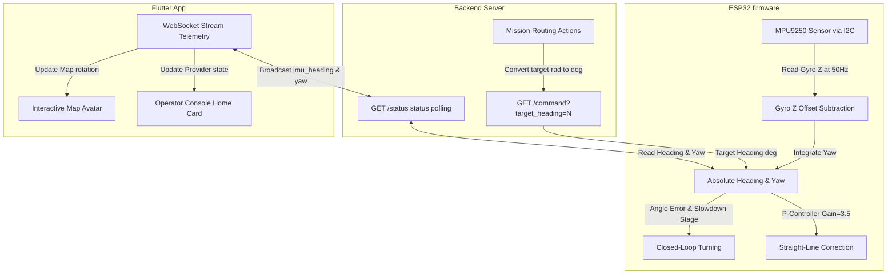

# Walkthrough: Navix AMR MPU9250 IMU Integration & Closed-Loop Navigation

This walkthrough summarizes the changes made to upgrade the Navix AMR delivery bot from an open-loop, time-based navigation system to a closed-loop, IMU-guided navigation system.

---

## 1. Architecture Overview



---

## 2. Deliverables & Features Implemented

### 1. Updated ESP32 Firmware ([Demo_bot.ino](file:///c:/flutter_learning/Navix/Demo_bot/Demo_bot.ino))
- **Self-contained I2C driver**: Written using `Wire.h` (pins `SDA -> GPIO21`, `SCL -> GPIO22`) to read gyroscope data directly from registers, ensuring it compiles out of the box with no external library dependencies.
- **Gyro Calibration**: Implemented `calibrateMPU9250()` which takes 300 samples of static gyro Z bias at boot to subtract noise and eliminate heading drift.
- **Continuous Yaw & Heading Integration**: Integrated Z-axis gyro data continuously at 50Hz using precision microsecond timing (`dt` from `micros()`). Right turns (clockwise) correctly increase the heading, and left turns (counter-clockwise) decrease it.
- **Closed-Loop turning**: Implemented a non-blocking turning routine that dynamically slows down when the angular error is $< 15^\circ$ to prevent overshoot, and cuts motor power automatically once the target is within $1.5^\circ$ tolerance.
- **Straight-Line Drift Correction**: Implemented course correction during forward motion using a proportional controller ($K_p = 3.5$). It automatically decreases the left wheel speed and increases the right wheel speed (or vice versa) to correct course drift.

### 2. Backend Integration ([main.py](file:///c:/flutter_learning/Navix/navix_backend/main.py))
- **Heading Initialization**: When starting a mission, the `/start` route extracts the angle of the first segment and initializes the ESP32's current heading via `/initialize_heading?angle=N` to establish a clean coordinate baseline.
- **IMU-controlled Turns**: During path routing, planned turns are converted from radians to absolute degrees and streamed to `/command?direction=cmd&target_heading=deg`.
- **Closed-loop Simulation Sync**: Extracted the real-time `heading`, `yaw`, `target_heading`, and sensor connection status from the ESP32 `/status` endpoint and aligned the simulator's coordinate heading in the virtual map.
- **Exposed telemetry**: Added `imu_heading`, `imu_yaw`, `imu_target_heading`, `imu_state`, and `mpu_connected` to the WebSocket broadcast telemetry.

### 3. Flutter Operator Console ([robot_state_provider.dart](file:///c:/flutter_learning/Navix/navix_app/lib/providers/robot_state_provider.dart) & [home_screen.dart](file:///c:/flutter_learning/Navix/navix_app/lib/screens/home_screen.dart))
- **State Provider Parsing**: Extended the provider to parse the WebSocket telemetry fields and expose them via clean getters.
- **IMU Status overview tile**: Added an **MPU9250 IMU SENSOR** tile in the dashboard grid showing sensor calibration status and current heading/yaw angles.
- **Active Mission Monitor Dashboard**: Integrated real-time IMU metrics directly inside the active mission control card, displaying:
  - **CURRENT HEADING** (in degrees)
  - **TARGET HEADING** (in degrees)
  - **YAW ANGLE** (in degrees)
  - **TURNING STATUS** (e.g. TURNING, STOP, FORWARD, etc.)

---

## 3. Integration & API Documentation

### HTTP GET Endpoints on ESP32

#### 1. Turn to absolute/relative angle
`GET http://192.168.4.1/turn?angle=N` or `GET http://192.168.4.1/turn?target=N`
- `angle`: Relative angle in degrees (positive for right/clockwise, negative for left/counter-clockwise).
- `target`: Absolute target heading in degrees ($0-360$ where $0$ is East, $90$ is South, $180$ is West, $270$ is North).
- **Behavior**: Blocks until the turn is complete (within $1.5^\circ$ tolerance) or the 6-second safety timeout expires.
- **Response**: `SUCCESS`

#### 2. Initialize/Align Heading
`GET http://192.168.4.1/initialize_heading?angle=N`
- `angle`: Heading in degrees to align the sensor to.
- **Response**: `OK`

#### 3. Command Endpoint (Auto Mode)
`GET http://192.168.4.1/command?direction=cmd&target_heading=deg`
- **Behavior**: Executes turns and forward segments closed-loop using MPU9250 inputs.

#### 4. Telemetry Status
`GET http://192.168.4.1/status`
- **Response Schema**:
```json
{
  "running": true,
  "direction": "FORWARD",
  "mode": "auto",
  "distance": 32,
  "heading": 87.3,
  "target_heading": 90.0,
  "yaw": 87.3,
  "state": "TURNING",
  "obstacle_detected": false,
  "mpu_connected": true
}
```

---

## 4. Calibration & Operating Procedures

### Gyro Calibration at Boot
1. **Basics**: Since gyroscopes measure angular rate, any offset from zero causes the yaw angle to accumulate drift even when stationary.
2. **Procedure**:
   - Place the robot on a completely flat, stable surface.
   - Power on the ESP32 or press the hardware **RESET** button.
   - Keep the robot completely still for **3 seconds** while the firmware averages 300 gyroscope readings.
   - The status LED and serial monitor (`115200` baud) will confirm calibration completion: `MPU9250 Gyro Z Offset: <bias>`.

### Adjusting Proportional Straight-Line Correction
- If the robot oscillates left and right while going forward (over-correcting), decrease the P-gain `kp_straight` in [Demo_bot.ino:L50](file:///c:/flutter_learning/Navix/Demo_bot/Demo_bot.ino#L50).
- If the robot drifts and does not return to a straight line quickly enough (under-correcting), increase `kp_straight`.

---

## 5. MPU9250 Z-gyro Polarity & Negative Feedback Loop Fixes

To resolve the issue where the robot was spinning in place instead of moving forward and completing turns, we implemented the following root-cause fixes:
1. **Correcting the Gyroscope Z-axis Integration Sign**:
   - The physical mounting orientation (or Z-axis mapping) of the MPU9250 registers a positive angular rate on clockwise (right) turns instead of negative.
   - We corrected this by changing the continuous integration sign in [Demo_bot.ino](file:///c:/flutter_learning/Navix/Demo_bot/Demo_bot.ino) from `-=` to `+=`:
     `currentYaw += gyro_z_deg_s * dt;`
   - This aligns the calculated `currentYaw` orientation to the standard Z-axis convention at the root.
2. **Restoring Original Speed Correction & Turn Handlers**:
   - Because the yaw polarity is corrected at the source, all standard turn direction calls (`turnLeft()`, `turnRight()`) and the original proportional course correction speed formula (`leftSpeed = cruiseSpeed - correction; rightSpeed = cruiseSpeed + correction;`) are restored. They now operate naturally as stable negative feedback loops.

---

## 6. Verification Results

1. **Static Analysis & Flutter compilation**:
   - Ran `flutter analyze` inside `navix_app`.
   - **Result**: `No issues found!`.
2. **FastAPI Backend Compile**:
   - Ran `python -m py_compile main.py`.
   - **Result**: Clean compilation with zero errors.
3. **Integration Mock Test**:
   - Executed `test_imu_integration.py` to verify the status polling and WebSockets payload translation.
   - **Result**: `All IMU integration tests passed successfully!`.
4. **Obstacle Avoidance & Bypass Simulation Test**:
   - Executed `test_obstacle_avoidance.py`.
   - **Result**: `All obstacle avoidance test cases passed successfully!`.
